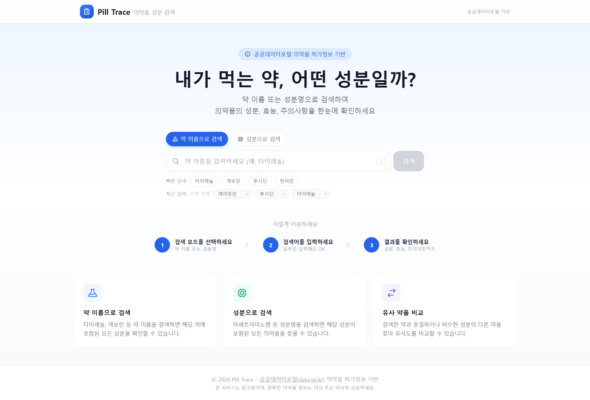
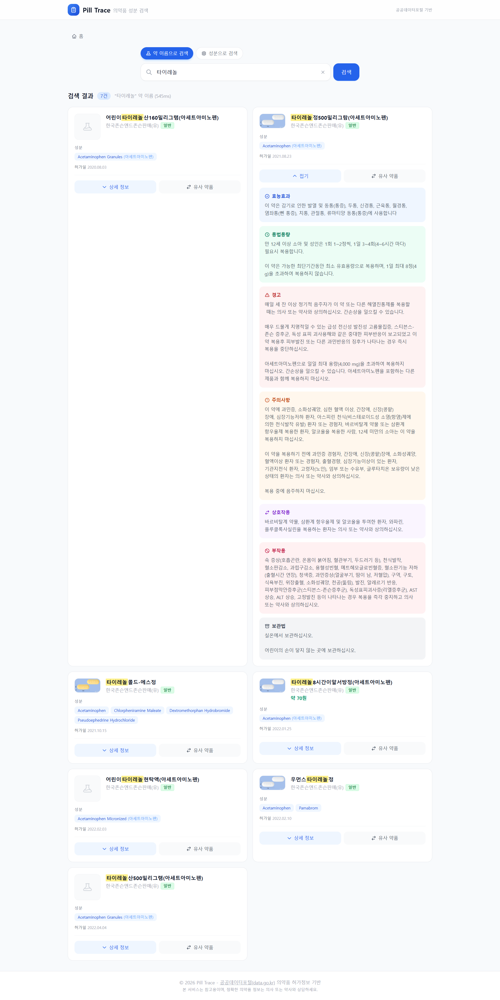
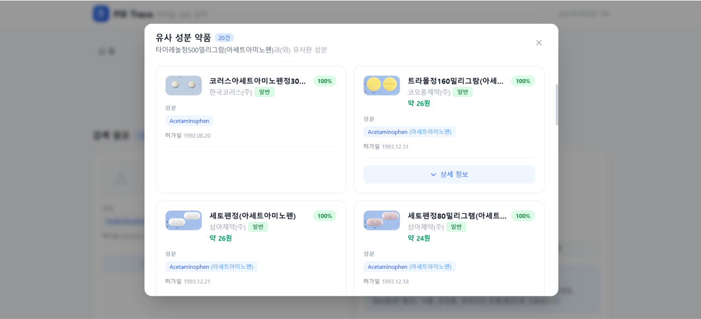

# Pill Trace - 의약품 성분 검색

약 이름이나 성분명으로 의약품을 검색하고, 동일/유사 성분의 약을 찾아보세요.

## 스크린샷

### 메인 페이지


### 검색 결과


### 유사 성분 약품 모달


## 주요 기능

- **약 이름으로 검색** - 타이레놀, 게보린 등 약 이름을 검색하면 해당 약에 포함된 모든 성분을 확인
- **성분으로 검색** - 아세트아미노펜 등 성분명을 검색하면 해당 성분이 포함된 모든 의약품을 검색
- **유사 약품 비교** - 검색한 약과 동일하거나 비슷한 성분의 다른 약을 찾아 유사도를 비교
- **상세 정보 조회** - 효능효과, 용법용량, 주의사항, 부작용 등 상세 정보 확인

## 기술 스택

- **Framework**: Next.js 14 (App Router)
- **Language**: TypeScript
- **Styling**: Tailwind CSS
- **API**: 공공데이터포털 (data.go.kr) 의약품 허가정보

## 시작하기

### 1. 의존성 설치

```bash
npm install
```

### 2. 환경 변수 설정

`.env.example`을 `.env.local`로 복사한 후 API 키를 설정하세요.

```bash
cp .env.example .env.local
```

[공공데이터포털](https://www.data.go.kr)에서 아래 API에 대한 활용 신청 후 발급받은 키를 입력하세요:
- 의약품 제품 허가정보 서비스
- 의약품개요정보(e약은요) 서비스

### 3. 개발 서버 실행

```bash
npm run dev
```

[http://localhost:3000](http://localhost:3000)에서 확인할 수 있습니다.

## 프로젝트 구조

```
src/
├── app/
│   ├── api/drugs/       # API 라우트 (공공데이터 프록시)
│   │   ├── search/      # 약 이름 검색
│   │   ├── ingredients/ # 성분명 검색
│   │   ├── similar/     # 유사 약품 검색
│   │   └── easy/        # 상세 정보 조회
│   ├── layout.tsx       # 루트 레이아웃
│   ├── page.tsx         # 메인 페이지
│   ├── not-found.tsx    # 404 페이지
│   └── globals.css      # 글로벌 스타일
├── components/
│   ├── SearchBar.tsx    # 검색바
│   ├── DrugCard.tsx     # 약품 카드
│   ├── Pagination.tsx   # 페이지네이션
│   └── SimilarDrugsModal.tsx # 유사 약품 모달
├── lib/
│   └── api.ts           # API 유틸리티
└── types/
    └── drug.ts          # 타입 정의
```

## 참고

본 서비스는 참고용이며, 정확한 의약품 정보는 의사 또는 약사와 상담하세요.
